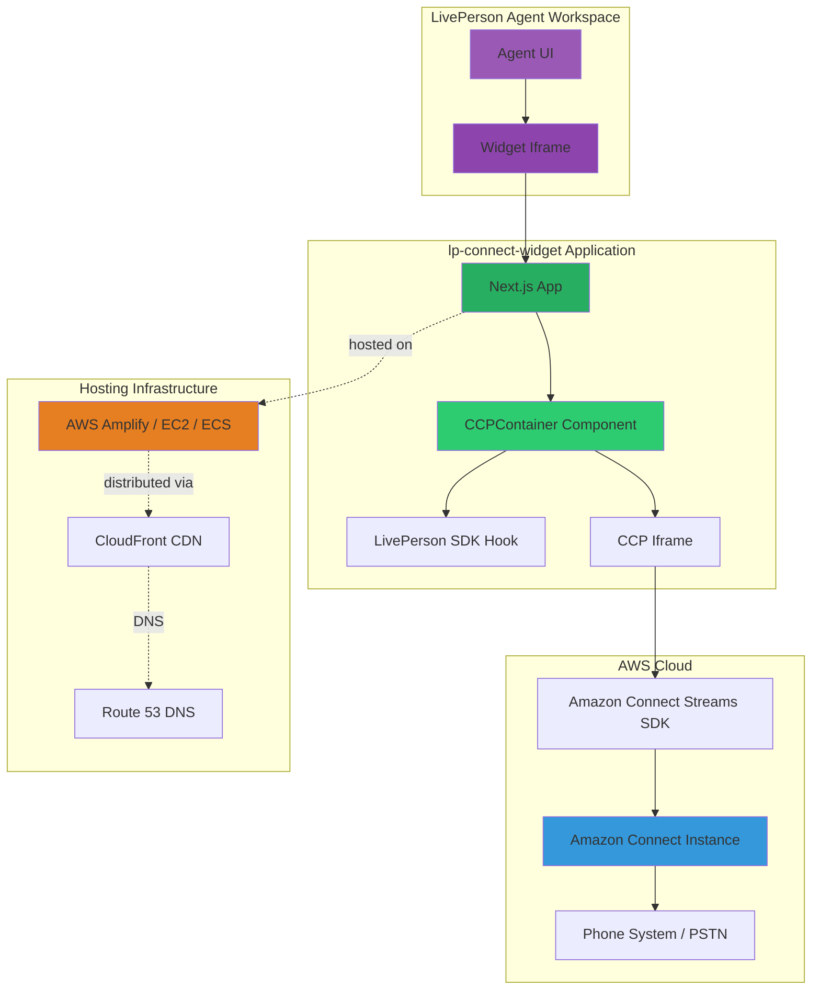
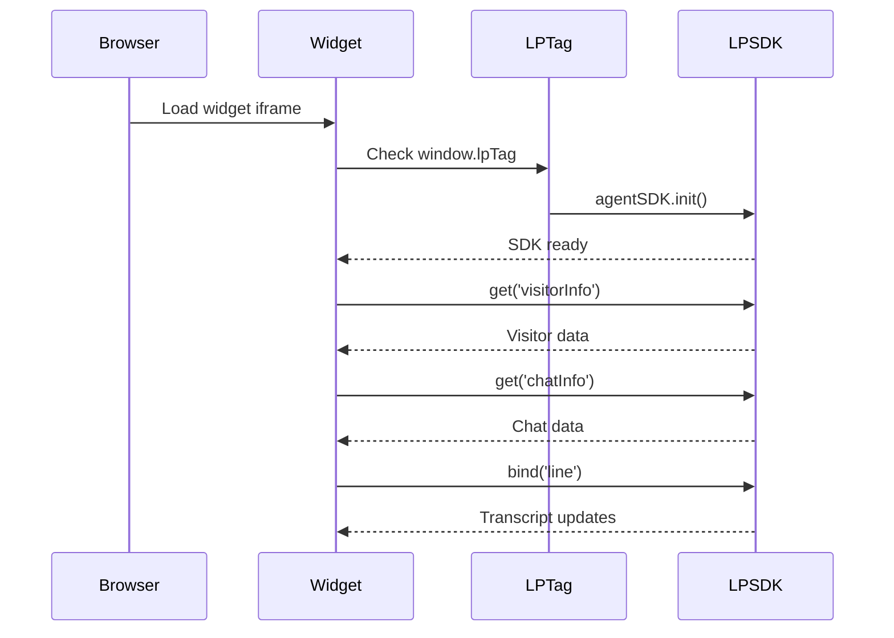
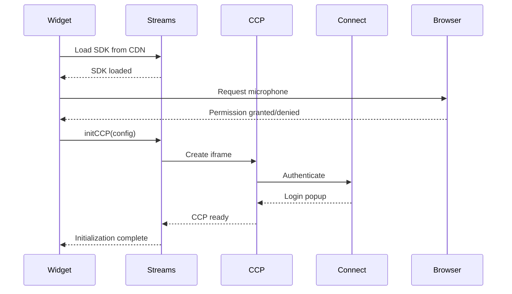
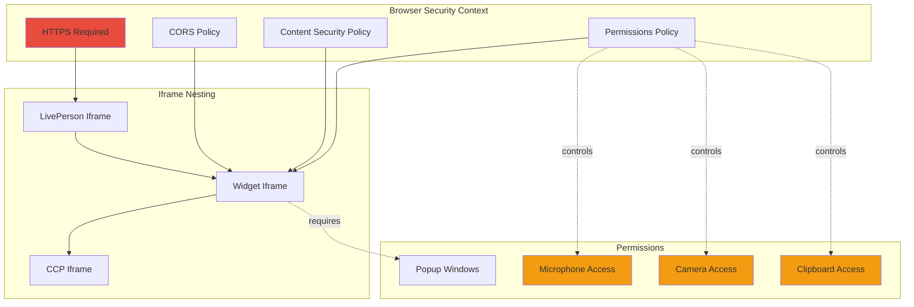
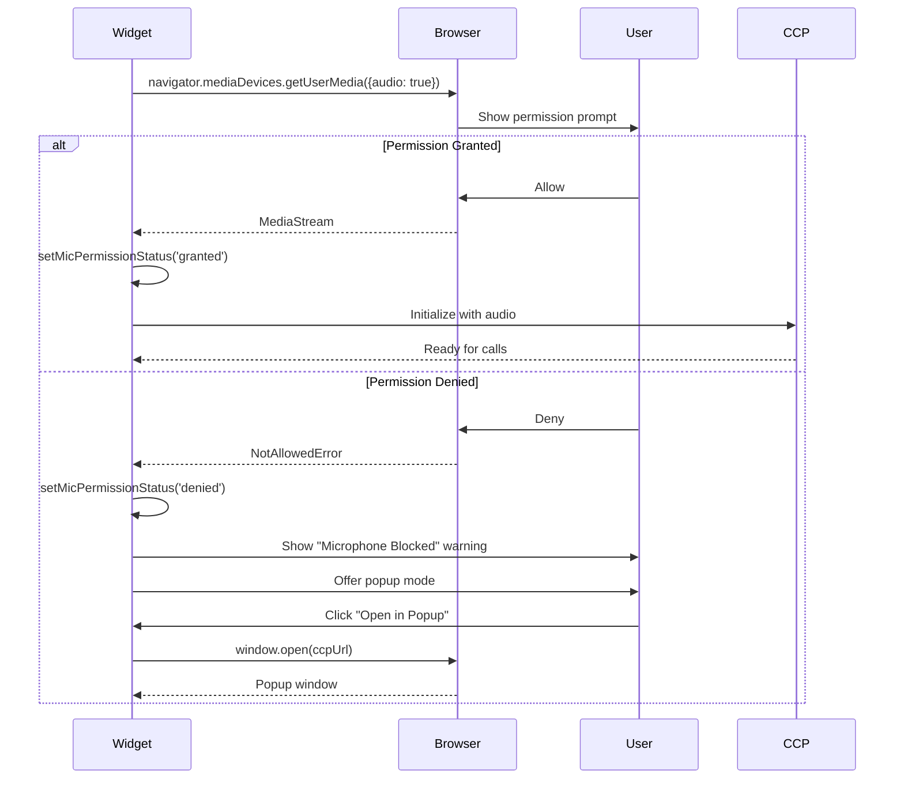
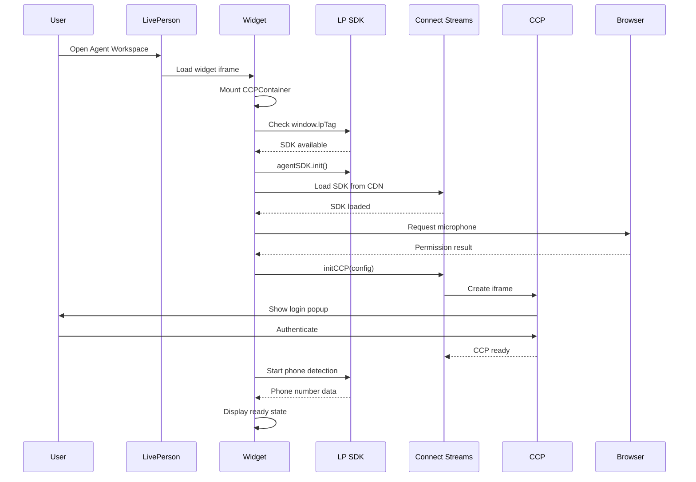
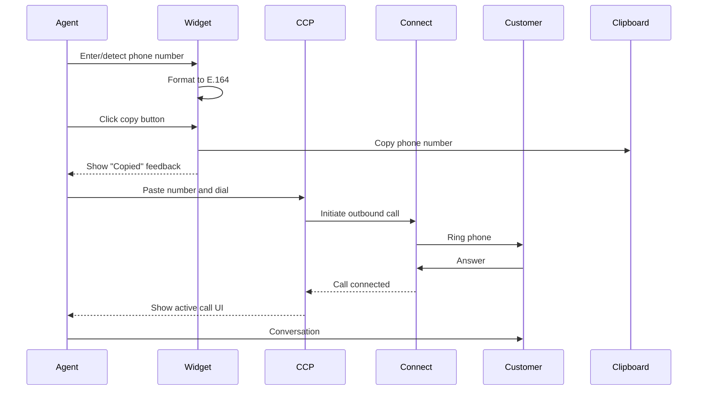
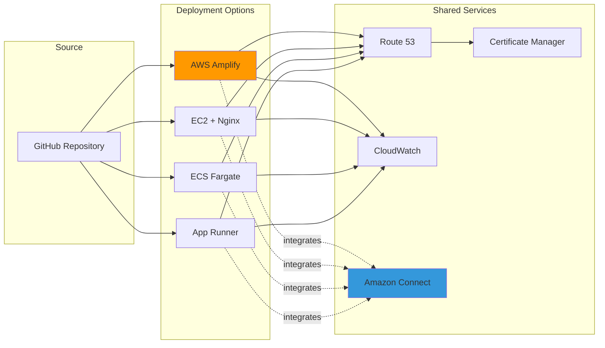

# Architecture Documentation

This document provides a comprehensive overview of the LivePerson + Amazon Connect Widget architecture, including system design, component interactions, integration patterns, and technical implementation details.

## Table of Contents

- [System Overview](#system-overview)
- [High-Level Architecture](#high-level-architecture)
- [Component Breakdown](#component-breakdown)
- [Integration Architecture](#integration-architecture)
- [Phone Number Detection Pipeline](#phone-number-detection-pipeline)
- [Security Architecture](#security-architecture)
- [Technology Stack](#technology-stack)
- [Design Patterns](#design-patterns)
- [Data Flow](#data-flow)

---

## System Overview

The LivePerson + Amazon Connect Widget is a Next.js application that bridges LivePerson's Agent Workspace with Amazon Connect's Contact Control Panel (CCP), enabling agents to handle voice calls directly within the LivePerson interface.

### Key Capabilities

- **Embedded CCP**: Amazon Connect softphone embedded in LivePerson widget
- **Phone Number Detection**: Automatic extraction from LivePerson conversation data
- **Microphone Management**: Intelligent handling of browser permissions
- **Popup Fallback**: Alternative mode when iframe restrictions apply
- **Click-to-Call**: One-click dialing with E.164 formatting

---

## High-Level Architecture



### Architecture Layers

1. **Presentation Layer**: LivePerson Agent Workspace UI
2. **Widget Layer**: Next.js application in iframe
3. **Integration Layer**: LivePerson SDK + Amazon Connect Streams SDK
4. **Service Layer**: Amazon Connect Instance
5. **Infrastructure Layer**: AWS hosting services

---

## Component Breakdown

### 1. Next.js Application ([page.tsx](file:///Users/jeha/Documents/Code/lp-connect-widget/app/page.tsx))

**Responsibility**: Application entry point and configuration

**Key Features**:
- Environment variable management
- Root component rendering
- Global configuration

**Code Structure**:
```typescript
export default function Home() {
  const CONNECT_INSTANCE_URL = process.env.NEXT_PUBLIC_CONNECT_INSTANCE_URL;
  const CONNECT_REGION = process.env.NEXT_PUBLIC_CONNECT_REGION;
  
  return <CCPContainer instanceUrl={CONNECT_INSTANCE_URL} region={CONNECT_REGION} />;
}
```

---

### 2. CCPContainer Component ([CCPContainer.tsx](file:///Users/jeha/Documents/Code/lp-connect-widget/app/components/CCPContainer.tsx))

**Responsibility**: Core widget logic and CCP integration

**Key Features**:
- Amazon Connect Streams SDK initialization
- Microphone permission management
- Phone number detection (3-level strategy)
- Popup fallback mode
- E.164 phone number formatting
- Clipboard integration

**State Management**:
```typescript
const [isInitializing, setIsInitializing] = useState(true);
const [micPermissionStatus, setMicPermissionStatus] = useState<'unknown' | 'granted' | 'denied'>('unknown');
const [mode, setMode] = useState<'embedded' | 'popup'>('embedded');
const [phoneNumber, setPhoneNumber] = useState<string>('+1 (555) 012-3456');
const [phoneDetected, setPhoneDetected] = useState(false);
```

**Lifecycle**:
1. Component mounts
2. Load Amazon Connect Streams SDK from CDN
3. Request microphone permission
4. Initialize CCP with configuration
5. Start phone number detection
6. Handle user interactions

---

### 3. LivePerson SDK Hook ([useLPTag.ts](file:///Users/jeha/Documents/Code/lp-connect-widget/app/hooks/useLPTag.ts))

**Responsibility**: LivePerson Agent SDK integration

**Key Features**:
- SDK initialization
- Event binding helpers
- Safe access to `window.lpTag`

**Interface**:
```typescript
interface LpTag {
  agentSDK: {
    init: (config?: any) => void;
    bind: (key: string, callback: (data: any) => void) => void;
    get: (key: string, callback: (data: any) => void) => void;
    command: (cmdName: string, cmdData: any, callback?: (err: any) => void) => void;
  };
}
```

**Usage**:
```typescript
const { valid, sdk } = useLPTag();

// Fetch visitor information
sdk.get('visitorInfo', (data) => {
  console.log('Visitor data:', data);
});
```

---

### 4. Amazon Connect Streams SDK

**Responsibility**: CCP iframe management and telephony control

**Integration Method**: Loaded via CDN script tag

```typescript
const script = document.createElement('script');
script.src = 'https://cdn.jsdelivr.net/npm/amazon-connect-streams@2.22.0/release/connect-streams-min.js';
```

**Initialization Configuration**:
```typescript
window.connect.core.initCCP(containerRef.current, {
  ccpUrl: instanceUrl,
  loginPopup: true,
  loginPopupAutoClose: true,
  region: region,
  softphone: {
    allowFramedSoftphone: true,
    disableRingtone: false,
    allowFramedVideoCall: true,
    allowEarlyGum: true
  },
  pageOptions: {
    enableAudioDeviceSettings: true,
    enableVideoDeviceSettings: true,
    enablePhoneTypeSettings: true
  }
});
```

---

## Integration Architecture

### LivePerson Integration



**Integration Points**:

1. **visitorInfo**: Customer profile data
2. **chatInfo**: Conversation metadata and pre-chat survey
3. **line**: Real-time transcript events

---

### Amazon Connect Integration



**Integration Points**:

1. **CCP Iframe**: Embedded contact control panel
2. **Streams SDK**: JavaScript API for CCP control
3. **Authentication**: OAuth via popup window
4. **Softphone**: WebRTC-based voice calling

---

## Phone Number Detection Pipeline

The widget implements a 3-level detection strategy to automatically find customer phone numbers:

```mermaid
flowchart TD
    Start([Widget Initialized]) --> L1[Level 1: visitorInfo API]
    
    L1 --> L1Q{Check fields:<br/>phone, phoneNumber,<br/>cellPhoneNumber}
    L1Q -->|Found| L1F[Format to E.164]
    L1F --> Use([Use Phone Number])
    L1Q -->|Not Found| L2[Level 2: chatInfo API]
    
    L2 --> L2Q{Check fields:<br/>phone, phoneNumber,<br/>surveyQuestions}
    L2Q -->|Found| L2F[Format to E.164]
    L2F --> Use
    L2Q -->|Not Found| L3[Level 3: Transcript Regex]
    
    L3 --> L3R[Apply Regex Pattern:<br/>/\+?\d{1,3}....\d{4}/g]
    L3R --> L3Q{Phone Pattern<br/>Found?}
    L3Q -->|Found| L3F[Format to E.164]
    L3F --> Use
    L3Q -->|Not Found| Mock[Use Mock Number:<br/>+1 555 012-3456]
    Mock --> Use
    
    style L1 fill:#3498db
    style L2 fill:#2ecc71
    style L3 fill:#e67e22
    style Use fill:#27ae60
    style Mock fill:#95a5a6
```

### Level 1: visitorInfo API

**Source**: LivePerson visitor profile

**Fields Checked**:
- `data.phone`
- `data.phoneNumber`
- `data.cellPhoneNumber`
- `data.mobilePhone`
- `data.personalInfo.phone`

**Implementation**:
```typescript
sdk.get('visitorInfo', (data: any) => {
  const phoneCandidate = 
    data?.phone || 
    data?.phoneNumber || 
    data?.cellPhoneNumber || 
    data?.mobilePhone || 
    data?.personalInfo?.phone;
  
  if (phoneCandidate) {
    setPhoneNumber(formatToE164(phoneCandidate));
  }
});
```

---

### Level 2: chatInfo API

**Source**: Pre-chat survey and conversation metadata

**Fields Checked**:
- `data.phone`
- `data.phoneNumber`
- `data.rtSessionId.phone`
- Survey questions containing "phone" or "number"

**Implementation**:
```typescript
sdk.get('chatInfo', (data: any) => {
  const phoneCandidate = 
    data?.phone || 
    data?.phoneNumber || 
    data?.rtSessionId?.phone ||
    data?.surveyQuestions?.find(q => 
      q.question?.toLowerCase().includes('phone')
    )?.answer;
  
  if (phoneCandidate) {
    setPhoneNumber(formatToE164(phoneCandidate));
    setPhoneDetected(true);
  }
});
```

---

### Level 3: Transcript Regex Scanning

**Source**: Real-time conversation transcript

**Pattern**: International phone number regex

```typescript
const phoneRegex = /(\+?\d{1,3}[-\.\s]?)?\(?\d{3,4}\)?[-\.\s]?\d{3,4}[-\.\s]?\d{4}/g;
```

**Matches**:
- `+6581578063`
- `(555) 123-4567`
- `555-123-4567`
- `+1 555 123 4567`
- `555.123.4567`

**Implementation**:
```typescript
sdk.bind('line', (lines: any) => {
  for (const line of lines) {
    const text = line.text || '';
    const matches = text.match(phoneRegex);
    
    if (matches && matches.length > 0) {
      setPhoneNumber(formatToE164(matches[0]));
      setPhoneDetected(true);
      break;
    }
  }
});
```

---

### E.164 Formatting

All detected phone numbers are normalized to E.164 format:

```typescript
const formatToE164 = (input: string): string => {
  const trimmed = input.trim();
  
  // Already in E.164 format
  if (trimmed.startsWith('+')) {
    return trimmed.replace(/[^0-9+]/g, '');
  }
  
  // Strip non-digits
  const clean = trimmed.replace(/\D/g, '');
  
  // North American numbers
  if (clean.length === 10) {
    return `+1${clean}`;
  } else if (clean.length === 11 && clean.startsWith('1')) {
    return `+${clean}`;
  }
  
  // Default: prepend +
  return `+${clean}`;
};
```

**Examples**:
- `(555) 123-4567` → `+15551234567`
- `555-123-4567` → `+15551234567`
- `+65 8157 8063` → `+6581578063`

---

## Security Architecture

### Browser Security Model



### Permissions Policy

Configured in [next.config.ts](file:///Users/jeha/Documents/Code/lp-connect-widget/next.config.ts):

```typescript
headers: [
  {
    key: 'Permissions-Policy',
    value: 'microphone=(self "https://jeffreyha.my.connect.aws" "https://ause1.le.liveperson.net"), camera=(self "https://jeffreyha.my.connect.aws" "https://ause1.le.liveperson.net"), clipboard-write=(self "https://ause1.le.liveperson.net")'
  }
]
```

**Grants**:
- **Microphone**: Widget, Amazon Connect, LivePerson
- **Camera**: Widget, Amazon Connect, LivePerson
- **Clipboard**: Widget, LivePerson

---

### Microphone Permission Flow



**Fallback Strategy**:
1. Try embedded mode with microphone
2. If denied, show warning with explanation
3. Offer popup mode (opens CCP in new window)
4. Popup mode bypasses iframe restrictions

---

### CORS Configuration

**Amazon Connect Side**:
- Configure in AWS Console → Amazon Connect → Application Integration
- Add widget domain to Approved Origins

**Widget Side**:
- Permissions-Policy headers allow cross-origin CCP
- Next.js configured to accept requests from LivePerson domains

---

## Technology Stack

### Frontend Framework

| Technology | Version | Purpose |
|------------|---------|---------|
| **Next.js** | 16.1.4 | React framework with SSR/SSG |
| **React** | 19.2.3 | UI component library |
| **TypeScript** | 5.x | Type-safe JavaScript |

### Styling

| Technology | Version | Purpose |
|------------|---------|---------|
| **Tailwind CSS** | 4.x | Utility-first CSS framework |
| **Framer Motion** | 12.28.1 | Animation library |

### Integrations

| Technology | Version | Purpose |
|------------|---------|---------|
| **amazon-connect-streams** | 2.22.0 | Amazon Connect CCP SDK |
| **LivePerson Agent SDK** | N/A | LivePerson integration (via `window.lpTag`) |
| **lucide-react** | 0.562.0 | Icon library |

### Build Tools

| Technology | Version | Purpose |
|------------|---------|---------|
| **npm** | 10.x | Package manager |
| **ESLint** | 9.x | Code linting |
| **PostCSS** | 4.x | CSS processing |

---

## Design Patterns

### 1. Custom Hooks Pattern

**useLPTag Hook**:
- Encapsulates LivePerson SDK logic
- Provides safe access to global `window.lpTag`
- Returns validation status and SDK reference

**Benefits**:
- Reusable across components
- Centralized SDK initialization
- Type-safe access

---

### 2. Progressive Enhancement

**Phone Number Detection**:
- Level 1: Structured API data (best)
- Level 2: Survey data (good)
- Level 3: Regex parsing (fallback)
- Mock data (development/failure case)

**Benefits**:
- Graceful degradation
- Multiple data sources
- Always functional

---

### 3. Fallback Strategy Pattern

**Microphone Access**:
- Primary: Embedded CCP with microphone
- Fallback: Popup window mode

**Clipboard Access**:
- Primary: `navigator.clipboard.writeText()`
- Fallback: `document.execCommand('copy')`

**Benefits**:
- Works in restricted environments
- Better user experience
- Handles browser limitations

---

### 4. Lazy Loading

**Amazon Connect Streams SDK**:
- Loaded dynamically via script tag
- Only when component mounts
- Reduces initial bundle size

```typescript
const script = document.createElement('script');
script.src = 'https://cdn.jsdelivr.net/npm/amazon-connect-streams@2.22.0/release/connect-streams-min.js';
script.async = true;
document.head.appendChild(script);
```

---

## Data Flow

### Initialization Flow



---

### Call Flow



---

## Performance Considerations

### Bundle Size Optimization

- **Next.js Code Splitting**: Automatic route-based splitting
- **Dynamic Imports**: Amazon Connect Streams loaded on-demand
- **Tree Shaking**: Unused code eliminated in production build

### Runtime Performance

- **React Hooks**: Efficient state management
- **useRef**: Prevent unnecessary re-renders
- **Memoization**: Callbacks wrapped in `useCallback` where appropriate

### Network Optimization

- **CDN Delivery**: Streams SDK from jsdelivr CDN
- **Caching**: Next.js automatic static optimization
- **Compression**: Gzip/Brotli enabled in production

---

## Browser Compatibility

### Supported Browsers

| Browser | Minimum Version | Notes |
|---------|----------------|-------|
| **Chrome** | 90+ | Recommended |
| **Edge** | 90+ | Chromium-based |
| **Firefox** | 88+ | Full support |
| **Safari** | 14+ | Microphone may require popup mode |

### Required Features

- WebRTC (for softphone)
- getUserMedia API (for microphone)
- ES2020+ JavaScript
- CSS Grid and Flexbox
- Iframe support

---

## Deployment Architecture

### AWS Hosting Options



See [02-AWS-DEPLOYMENT.md](file:///Users/jeha/Documents/Code/lp-connect-widget/docs/02-AWS-DEPLOYMENT.md) for detailed deployment instructions.

---

## Future Enhancements

### Potential Improvements

1. **Call History Tracking**: Store call logs in DynamoDB
2. **Analytics Dashboard**: Track call metrics and agent performance
3. **Multi-Language Support**: i18n for global deployments
4. **Advanced Call Controls**: Transfer, conference, hold via Streams API
5. **WebSocket Integration**: Real-time call status updates
6. **Screen Pop**: Automatic CRM record lookup on incoming calls

---

## References

### Documentation

- [Amazon Connect Streams API](https://github.com/amazon-connect/amazon-connect-streams)
- [LivePerson Agent SDK](https://developers.liveperson.com/agent-workspace-sdk-overview.html)
- [Next.js Documentation](https://nextjs.org/docs)
- [WebRTC API](https://developer.mozilla.org/en-US/docs/Web/API/WebRTC_API)

### Related Files

- [Setup Requirements](file:///Users/jeha/Documents/Code/lp-connect-widget/docs/01-SETUP-REQUIREMENTS.md)
- [AWS Deployment Guide](file:///Users/jeha/Documents/Code/lp-connect-widget/docs/02-AWS-DEPLOYMENT.md)
- [CCPContainer Component](file:///Users/jeha/Documents/Code/lp-connect-widget/app/components/CCPContainer.tsx)
- [useLPTag Hook](file:///Users/jeha/Documents/Code/lp-connect-widget/app/hooks/useLPTag.ts)
- [Next.js Configuration](file:///Users/jeha/Documents/Code/lp-connect-widget/next.config.ts)

---

**Last Updated**: 2026-01-26
